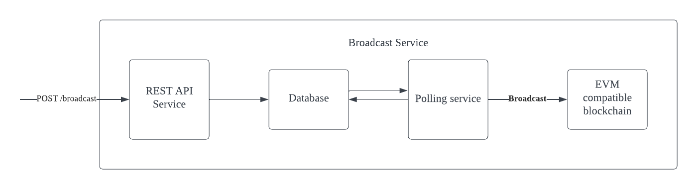

# Broadcast transaction service

## Assumptions
1. All the transactions that will be broadcasted to the EVM compatible blockchain have the possibility of being succesfully broadcasted, if the broadcast is retried enough times it should be able to be succesfully broadcasted.
2. The transaction broadcast will be retried until a maximum attempt threshold is reached, this is to prevent too many broadcast attempts.
3. The Admin will be able to retry failed broadcasts at anytime, this will be able to override the maximum attempt threshold.
4. An API endpoint will be provided to check the status of all the transactions.
5. An API endpoint will be provided for the admin to rebroadcast the failed transaction broadcast.
6. We can scale up the availability of this service using load balancing for the REST API Service, spawning multiple instances of the polling service and using databases with horizontal scaling.

## Components

### REST API Service
1. This service will be the endpoint which will receive the POST /broadcast_transaction.
2. This service will take care of all the validation of the request. The authorization, schema and any additional validation will be take care at this service.
3. When POST /broadcast_transaction is made, the API service will write the POST request body into a persistant Database like MySQL or PostgresSQL. These will later be broadcasted to the ethereum blockchain by the polling service.
4. This service will also be responsible to check the status of all current transactions that are broadcasted.
5. This service will also provide an endpoint for the admin to retry the transaction, this endpoint will override the special flag and enable the admin to retry broadcasting the transaction.

### Database
1. The Broadcast service will use a persistent datastore because if the broadcast service goes down or if the admin wants to manually retry a failed broadcast, the transaction will need to be rebroadcasted.
2. The database will store the POST requests body, the status of the broadcast(SUCCESS, FAILURE, PROGRESS, NOT STARTED), number of broadcast attempts, a special flag to overwrite the maximum broadcast attempts and other audit columns.

### Polling service
1. The transaction will be broadcasted to the ethereum blockchain from the polling service. 
2. The broadcast can be done from the REST API service but because the broadcasting takes a long time, this will slow down the API request times.
3. The polling service will be incharge of 2 functions, broadcasting new transactions and rebroadcasting failed transactions.
4. The polling service will broadcast all the transactions that are of status (NOT STARTED and FAILURE) and the number of broadcast attempts is less than the configurable maximum threshold or if the special flag is set to true.